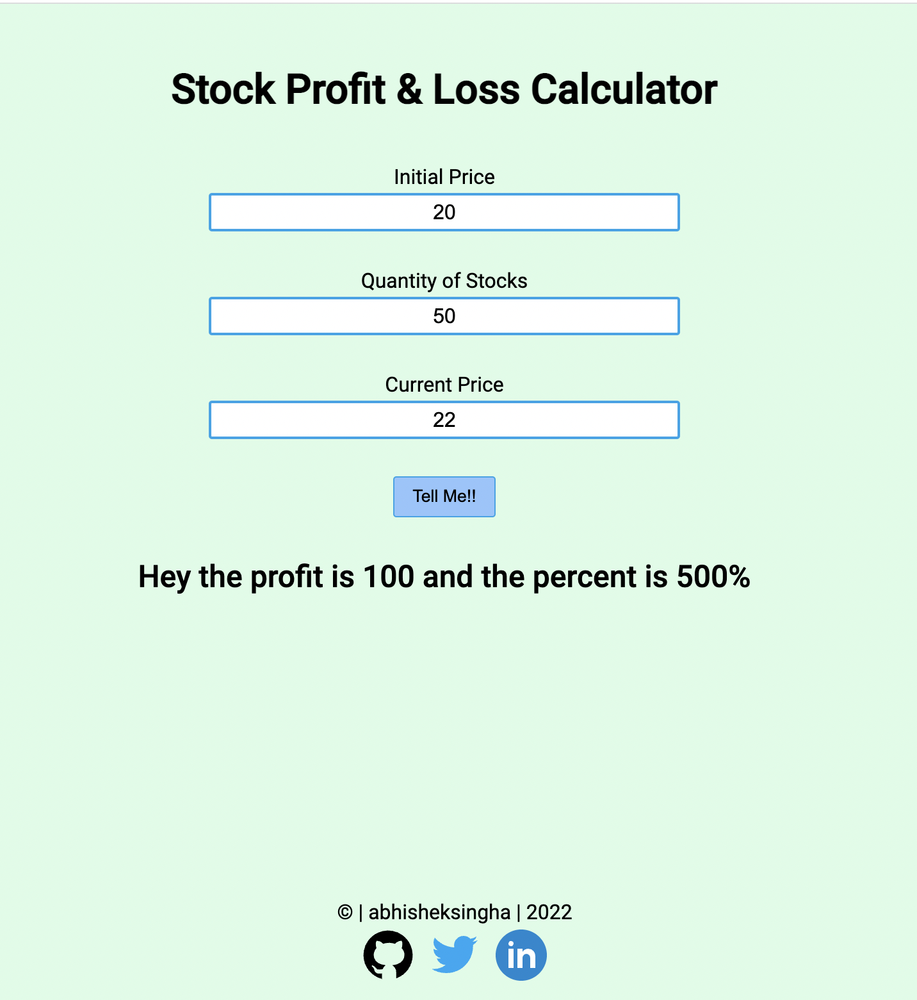

# Profit or loss calculator (stocks)

A website which helps user how much profit or loss in stocks he/she is making in percentage & absolute value.

## Demo -

You can view this app live here - [Demo](https://)

## Tech Stack -

HTML, JavaScript, CSS for styling

## Documentation -

This app is built using HTML, JavaScript and CSS for styling. Tells user how much profit or loss he/she is making in percentage & absolute value.

 Features -
- Take user's stock price for one stock when he bought as input.
- Take the quantity of stocks as input.
- Take today's stock price for that stock as input.
- Tell the user how much profit or loss he/she is making.
- Tell them the percentage and absolute value of profit or loss.

## Screenshots -

## Author -

- Abhishek Singha - [abk9778singha](https://github.com/abk9778singha)

